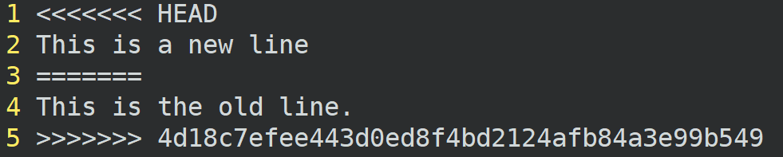

与我们料想的一样，由于远端代码的同一文件中存在着不同的内容(其他开发者进行了修改并同步到了远端分支)，
我们在从远端拉取(pull)代码时，与我们在本地的修改产生了冲突(conflict)。接下来我们将学习如何解决冲突。

## 任务

执行 `[[git status]]{{RUN}}` 查看当前目录的状态，输出中将会包含存在冲突的文件。

执行 `[[vi conflict_file]]{{RUN}}` 打开存在冲突的文件，并手动解决冲突，文件内容应如下图所示：

对于存在冲突的位置，本地仓库的修改将位于上方，处于特殊字符串
`<<<<<<< HEAD` 和 `=======` 之间，远端修改则位于特殊字符串 `=======` 和
`>>>>>>> remotes/origin/master` 之间。

通过vim编辑器完成冲突解决后，需要重新使用`git add`将存在冲突的文件添加到
暂存区域进行跟踪。执行下面的命令完成操作：

`[[git add .]]{{RUN}}`

`[[git commit]]{{RUN}}`

`[[git merge]]{{RUNc}}`
